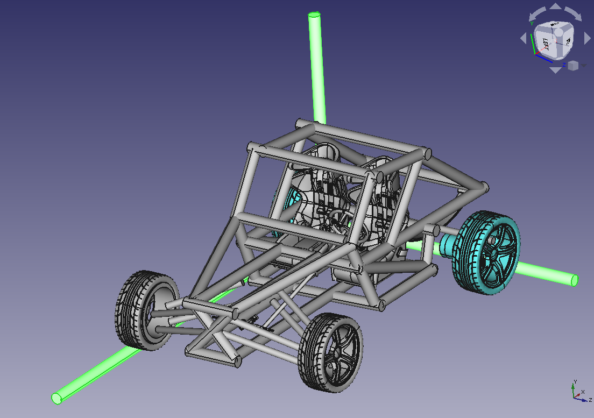

**Abstract:**

It is no secret that modern cars are complex. Your average Toyota has over 30,000 parts, and about 6000 moving parts. This means they are near impossible too modify, adjust, or repair without piles of specialized parts, 8 years in the automotive repair industry, and hundreds of hours of work.

Cars are so complex that they need to be 'diagnosed'. This is a disaster, cars have traded both simplicity and reliability for comfort.

Very few people have the time, skill, or patience to work on their cars, and so are forced to fork out thousands for even just minor damages, if done to an obscure enough part.

Just recently I had to pay over \~$1500 just because some small, obscure component broke in my car.

The goal of this project is to create the simplest, most reliable, and easy to fix car out there.

&#x200B;

**Goals:**

\- Over 100 miles Range

\- Street legal

\- Usable on an interstate

\- Dry interior (protection from the weather)

\- Toughness, should be built like a tank, simple and sturdy

\- Decent Off-road

\- Decent Towing

\- Fewest moving parts possible

\- Repairable with nothing but a wrench

\- Made out of standardized, cheap parts

\- You should be able to glance at it and understand how it works

\- Light enough that a person could reasonably pick up one side of the vehicle.

&#x200B;

**Non-goals:**

\- Air conditioning

\- Independent suspension

\- Mechanical speedometer ( Notes\[8\] )

\- High Acceleration

\- High Speed

\- Tight cornering

\- Using a Computer as opposed to dumb circuits to control the motor

\- Air bags

\- ABS, ECS, TCS or ECU (note: Tesla motor-breaking does not emulate ABS)

&#x200B;

**Neutral:**

\- Efficiency

\- Regenerative breaking ( Notes\[4\] )

&#x200B;

**Notes:**

\[0\] The lack of safety features on the vehicle means that it will have safety more akin to that of a motorcycle, than that of a modern car.

\[1\] Full 5 point harness to make up for the lack of airbags or solid non-canvas doors

\[2\] Body is either sheet metal bolted to the chassie, or canvas stretched over the body. If its the canvas, there should be a wratchiting mecanisim holding it over the entire body so that you could simple get 2 straight scraps of canvas, tarp, or any other material, and use it.

\[3\] Hub electric motors allow you to get rid of all gearing, all differential, and the entire headache of a gas engine.

\[4\] Salvaged Tesla motors are common, and will only get more and more common. we will be using those. This means that regenerative breaking will be built in to the motors, and accessible without any extra complexity.

>\>>> [www.tesla.com/blog/magic-tesla-roadster-regenerative-braking](https://www.tesla.com/blog/magic-tesla-roadster-regenerative-braking)  
>  
>The torque command can be positive or negative. When the torque serves to slow the vehicle then energy is returned to the battery and presto - we have regenerative braking!

\[5\] Solid axle's are simple, indestructible, and allow you to get rid of the headaches of independent suspension.

\[6\] Leaf springs have been used since the middle ages and are still indestructible, strong, adjustable, and modifiable with a wrench. Added benefit, if one of the spring plates snap, the car remains drivable. Salvageable from 18 wheelers, trailers, most old cars, modern trucks, buses etc.

\[7\] No differential, independent electric motors have enough give to allow wheels to spin at different speed. If the car gets stuck, possibly giving the user the option of manual control of the left and right motor?

\[8\] Speedometer can be provided by a cheap, [specialized GPS speedometer unit](https://www.amazon.com/TIMPROVE-Universal-Speedometer-Windshield-Motorcycle/dp/B07KZ2HT4S/ref=sr_1_3?crid=2E5EMV9BP1R8P&dchild=1&keywords=gps+speedometer&qid=1619624700&sprefix=gps+spe%2Cgarden%2C175&sr=8-3) mounted to the dash. No need for extra circus, or anything mechanical that could fail. This is simply to pass street legal inspection.

\[9\] The large problem to face with towing 

&#x200B;

**Development:**

Currently working on it in FreeCAD - [file](./car.FCStd)

```
$ git clone https://github.com/sketchsnipe/suckless-car
$ cd suckless-car
$ freecad car.FCStd
```


&#x200B;

**Inspirations:**

Gokarts, the primary thing ive worked on up unto this point.

Kit cars

Street legal "gokart" cars ( like the Ariel Atom 4 )

Dune Buggies

Tube chassie jeeps
